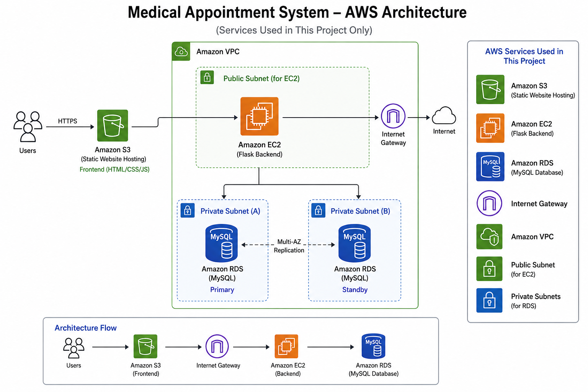

# <div align="center">

# 🏥 Hope Medical Center

### Cloud Patient Portal

*A Cloud-Based Medical Appointment Booking System built with Flask, MySQL & AWS*

<p align="center">


</p>

</div>

---

# 📖 About The Project

Hope Medical Center is a **full-stack cloud-based healthcare application** that allows patients to register, log in securely, and book medical appointments through an intuitive web interface.

The application is deployed on **Amazon EC2** using **Ubuntu Linux**, with **Nginx** serving the frontend and **Flask** powering the backend REST APIs. Patient information and appointment records are stored in a **MySQL** database.

This project demonstrates practical Cloud and DevOps skills including Linux administration, cloud deployment, networking, web server configuration, backend development, and version control.

---

# ✨ Features

✅ Patient Registration

✅ Secure Login Authentication

✅ Medical Appointment Booking

✅ Backend Health Status API

✅ MySQL Database Integration

✅ RESTful Flask APIs

✅ Responsive User Interface

✅ AWS Cloud Deployment

---

# 🛠 Tech Stack

| Category | Technologies |
|-----------|-------------|
| Frontend | HTML5, CSS3, JavaScript |
| Backend | Python, Flask, Flask-CORS |
| Database | MySQL |
| Web Server | Nginx |
| Cloud | AWS EC2 |
| OS | Ubuntu Linux |
| Networking | Security Groups, Elastic IP |
| Version Control | Git, GitHub |

---

# ☁ AWS Architecture

<p align="center">



</p>

### Architecture Flow

```text
                Internet
                     │
                     ▼
            AWS Security Group
                     │
                     ▼
              Elastic IP Address
                     │
                     ▼
        Amazon EC2 (Ubuntu Linux)
        ┌──────────────────────────┐
        │        Nginx             │
        │  Serves Frontend Files   │
        │                          │
        │ Flask REST API Backend   │
        └────────────┬─────────────┘
                     │
                     ▼
               MySQL Database
```

---

# 📂 Project Structure

```text
hope-medical-center-project/

│
├── backend/
│   ├── app.py
│   ├── requirements.txt
│   ├── database.sql
│   └── .env
│
├── frontend/
│   ├── index.html
│   ├── style.css
│   ├── code.js
│   └── heart.jpg
│
├── architecture/
│   └── aws-architecture.png
│
├── screenshots/
│   ├── home.png
│   ├── login.png
│   ├── register.png
│   └── appointment.png
│
└── README.md
```

---

# 📷 Application Screenshots

## 🏠 Home Page

<p align="center">

</p>

---

## 🔐 Login Page

<p align="center">

</p>

---

## 👤 Registration

<p align="center">

</p>

---

## 📅 Appointment Booking

<p align="center">

</p>

---

# 📡 API Endpoints

| Method | Endpoint | Description |
|----------|--------------------|---------------------------|
| GET | /api/status | Backend Status |
| POST | /api/signup | Register User |
| POST | /api/login | User Login |
| POST | /api/appointment | Book Appointment |

---

# ⚙ Installation

## Clone Repository

```bash
git clone https://github.com/Mrunal-2804/hope-medical-center-project.git

cd hope-medical-center-project
```

---

## Create Virtual Environment

```bash
python3 -m venv venv
```

---

## Activate Environment

Linux

```bash
source venv/bin/activate
```

Windows

```powershell
venv\Scripts\activate
```

---

## Install Dependencies

```bash
pip install -r backend/requirements.txt
```

---

## Configure Environment Variables

Create a `.env` file inside the backend directory.

Example:

```env
DB_HOST=localhost
DB_USER=root
DB_PASSWORD=your_password
DB_NAME=hope_medical_center
```

---

## Run Backend

```bash
python backend/app.py
```

---

## Open Frontend

Open

```text
frontend/index.html
```

or configure Nginx to serve the frontend.

---

# 🗄 Database

Create the database.

```sql
CREATE DATABASE hope_medical_center;
```

Import

```text
backend/database.sql
```

---

# 🔐 Security Features

- AWS Security Groups
- SSH Authentication
- Environment Variables (.env)
- MySQL Authentication
- CORS Configuration
- Backend Input Validation

---

# 📚 Skills Demonstrated

- AWS EC2 Deployment
- Ubuntu Linux Administration
- Nginx Configuration
- Flask REST APIs
- MySQL Integration
- Git & GitHub Workflow
- SSH Remote Management
- Cloud Networking
- Elastic IP Configuration

---

# 🚀 Future Improvements

- Docker Containerization
- Kubernetes Deployment
- Amazon RDS
- HTTPS using SSL
- CI/CD with GitHub Actions
- Application Load Balancer
- Auto Scaling
- CloudWatch Monitoring

---

# 👨‍💻 Author

## Mrunal Patil

Cloud & DevOps Enthusiast

📧 Email: *(Add your email)*

🔗 GitHub

https://github.com/Mrunal-2804

🔗 LinkedIn

(Add LinkedIn URL)

---

<div align="center">

### ⭐ If you found this project helpful, consider giving it a star!

Made with ❤️ by **Mrunal Patil**

</div>


# Hope Medical Demo

Quick local demo of a Flask backend + static frontend for booking appointments.

Requirements
- Python 3.8+
- MySQL server (local) with a database named `medical_db`.

Install dependencies

```bash
python -m pip install -r requirements.txt
```

Run the app

```bash
python app.py
```

Open in browser
- Visit `login.html` to sign up or log in.
- After login you'll be redirected to `index.html` to book appointments.

Database notes
- The app will auto-create `users` and `appointments` tables if they don't exist.
- Make sure `app.py` contains the correct MySQL credentials.
